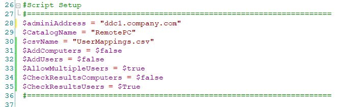
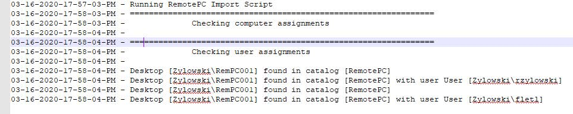
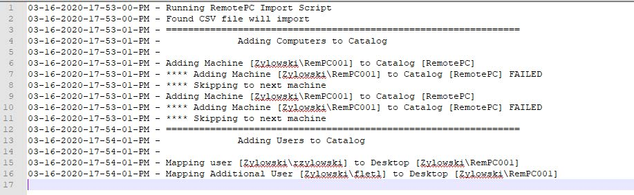

# Remote PC Load Script

## Overview

Many organizations re implementing a Citrix RemotePC  solution to allow workers working from home to connect to their office PC in response to the COVID-19 pandemic situation.  In support of this effort Citrix consulting created a PowerShell script to pre-load computers and pre-assign users to these computers based on an input file in CSV format.  This document is intended to provide an explanation of how to use the script and how the script works.

## High Level Summary

The script uses the Citrix Broker PowerShell SDK to add computers to a RemotePC Machine Catalog and then assigns users to the computers that were added.  The mapping of computers to users must be defined in a CSV file with a pre-defined format. 
The script is designed to run in several passes which can all be turned on or off.

1. The first pass will add the computers

2. The second pass will assign the users to the computers

3. The third pass will check that the computers and users were added and create csv files for missingcomputers or missing users.

The script can be configured to only assign one user per computer or allow multiple assignments.  It is possible by changing the script settings to just run the AddComputer logic or just run the AddUser logic.  This allows for pre-adding all computers then adding users as desired to match license compliance. 
Every time the script runs it will create a log folder with the date/time the script was run and a log file that details success/failure of each step plus csv's for missing computer or users. 

## Prerequisites

The script must be run from a machine that has access to the Citrix PowerShell SDK. For on-prem deployments, you could run the script from a Delivery Controller or a machine where the Citrix Studio Console has been installed. For Citrix Virtual Apps & Desktops Service in Citrix Cloud, please install the latest Remote Powershell SDK from [https://docs.citrix.com/en-us/citrix-virtual-apps-desktops-service/sdk-api.html](https://docs.citrix.com/en-us/citrix-virtual-apps-desktops-service/sdk-api.html)

The script must be downloaded and unblocked in windows.  Then a folder off the root of the file system should be created with no space in the name and the script should be copied there.

### Input File

The script will take input from a CSV file with a specific format.  The format used for the script is shown below.


If a new file is created, it must be kept in this format or the script will need to be modified to match any changes.
Each CSV file should be created to add the computers and user to a single catalog.  Multiple versions of the script can be run simultaneously to load multiple catalogs. The script is relatively fast.  Ten thousand machines can be
added in about 20 minutes.

## Script Setup

At the top of the script there is a section called script setup that must be modified to tailor the script.



### __Variable descriptions__

* **$adminAddress**

    This variable should be set to a delivery controller.  When running the script on a delivery controller it makes sense to use the one the script is running on.

* **$CatalogName**

    The script can only be run against one catalog at a time.  Enter the desired catalog here that matches the csv file being used.  Multiple catalogs can be processed at the same time by creating a separate folder/script to run against the Delivery Controller.

* **$InputFile**

    This variable defines the name of the input CSV file.  The fie should be stored in the same folder as the script.
    The next two variables provide a mechanism to control whether computers are added, users are added or both.

* **$AddComputers**

    This should be set to $true to add computers from the CSV or $false to skip adding computers.

* **$AddUsers**

    This should be set to $true to add User assignments from the CSV or $false to skip adding user assignments.
    Once these settings are configured and the  

* **$AllowMutlipleUsers**

    This should be set to $true to allow the script to add multiple users to the same desktop.  If this is $false only the first user assignment per machine will be executed.

* **$CheckResultsComputers**

    This should be set to $true to tell the script to check if computers were assigned and create a MissingVDAs.csv file in the log folder.

* **$CheckResultsUsers**

    This should be set to $true to tell the script to check if users were assigned and create a MissingUsers.csv file in the log folder.

## Running the Script

In order to run the script:

1. Ensure that the Powershell execution policy is set correctly.

    ```powershell
    Set-ExecutionPolicy -ExecutionPolicy RemoteSigned
    ```

2. Create the mapping file.

    a. Make sure the format of the username and domain name are correct.

3. For the first test, copy the mapping file and remove all but the first 5 entries in order to perform a controlled test.

4. Configure the Script Setup Settings as desired for the test.

5. Run the script.

6. Check the results and logs.

7. Modify the settings to use the full mapping file.

8. Run the script.

9. Check the results and logs.

## Logging

The script creates a log file in a "Log" folder in the same folder as where the script is located.  The Log folder will have a subfolder for each log based on date/time the script was run.  The log file will be named **RemotePC_Import_log.txt** within that folder.

The script will log successes and failures.





## Script Details

In this section we will describe the script in more technical detail.  The logic of the script is in the following order:

1. First the SDK is loaded if it's not already loaded

2. asnp Citrix*

3. Variables are defined

4. The script check for the log folder and creates it if it not there

5. A log folder for this run is created with the format "MM-dd-yyyy-HH-mm-tt"

6. The CSV file is loaded into an Array. If the CSV file is not found the script is exited.

7. The script gets the catalog.  If the catalog cannot be obtained the script is exited.

8. The CSV file is looped through to Add Computers

    a. For each line the Computer and UserName are parsed out.

    b. If the machine field in the CSV is blank the record is skipped

    c. The machine is then added to the catalog using New-BrokerMachine

    ```powershell
    New-BrokerMachine -MachineName $Machine -CatalogUid $RemotePCCatalog.Uid
    ```

    d. If the add fails a log entry is created

9. Then a 60 second sleep is run to ensure the machines are added before the users are assigned

10. The CSV is looped thorough again to assign users to the machines

    a. If the Machine is empty, we skip that record

    b. Then we get the desktop by name using

    ```powershell
    $GetDesktop = Get-BrokerPrivateDesktop $Machine -AdminAddress $adminiAddress
    ```

    c. Then user assignment is checked

    ```powershell
    $GetAssignedUser = Get-BrokerUser -AdminAddress $adminiAddress -PrivateDesktopUid $GetDesktop.Uid
    ```

    d. If no user is assigned, then the user is assigned using $AllowMultipleUsers is $true

    e. If it is true, all the already assigned users are written to an array

    f. Then the current user is checked against the array.  If they are not present, they will be added using

    ```powershell
    Add-BrokerUser -AdminAddress $adminiAddress -PrivateDesktop $Machine -Name $UserName
    ```

    g. If **$AllowMultipleUsers** is not set to $true and there was an assigned user this is logged but the new user assignment is not executed. Also in this case If a user is already assigned a log entry is made and the line is skipped.

    h. If the assignment fails a log entry is generated.

11. If $CheckResultsComputers is $true, then the script will go through each line in the csv and check to see if the computer has been added.

    a. If the Machine is empty, we skip that record

    b. We then get the desktop information using

    ```powershell
    $GetDesktop = Get-BrokerPrivateDesktop $Machine -AdminAddress $adminiAddress -ErrorAction:SilentlyContinue
    ```

    c. If Get-BrokerPrivateDesktop fails, we write to the log and add this machine to our output string

    d. After all desktops have been checked any missing desktops are written into a csv file named MissingVDAs.csv in the log folder

12. If $CheckResultsUsers is $true, then the script will go through each line in the csv and check to see if the users have been added.

    a. If the Machine is empty, we skip that record

    b. We then get the desktop information using

    ```powershell
    $GetDesktop = Get-BrokerPrivateDesktop $Machine -AdminAddress $adminiAddress -ErrorAction:SilentlyContinue
    ```

    c. If Get-BrokerPrivateDesktop fails, we write to the log and add this user to our output string

    d. If the machine is found, the script will then get assigned users using

    ```powershell
    $GetAssignedUser = Get-BrokerUser -AdminAddress $adminiAddress -PrivateDesktopUid $GetDesktop.Uid
    ```

    e. If no user is assigned the user will be added to the missing list

    f. If users are assigned and $AllowMultipleUsers is $true then all assigned users will be added to an array

    g. The current user is then checked against the array.  If the user is not in the array the user is added to the missing list

    h. After all users have been checked any missing users are written into a csv file named MissingUsers.csv in the log folder
